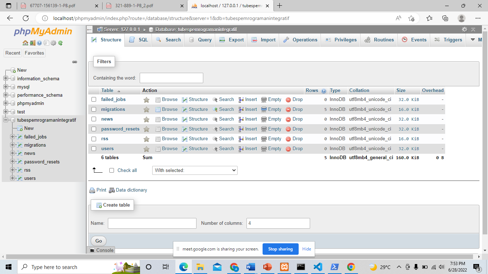
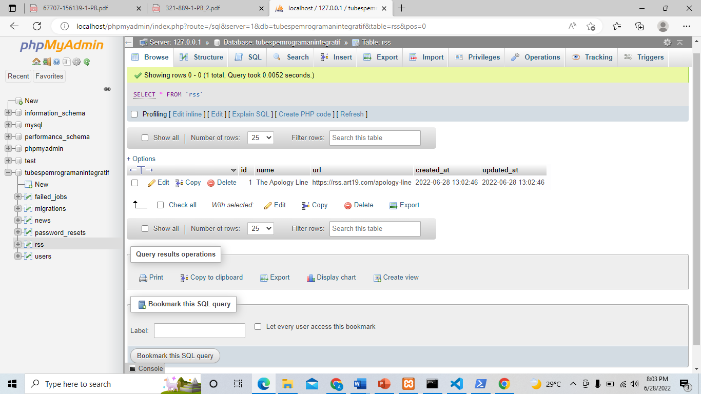
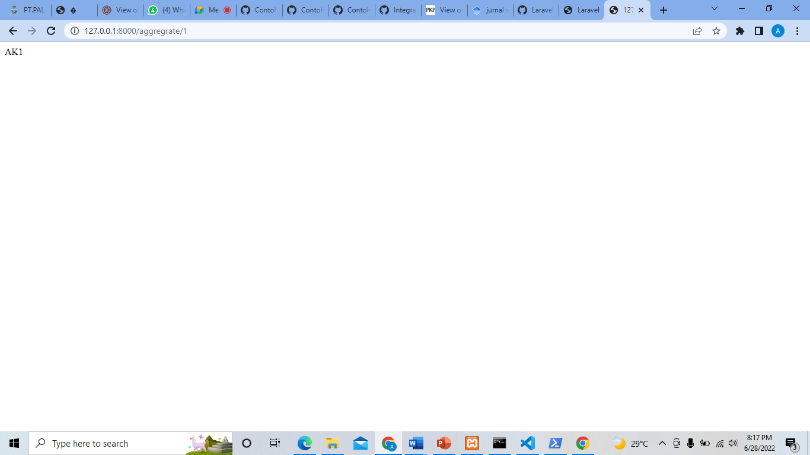
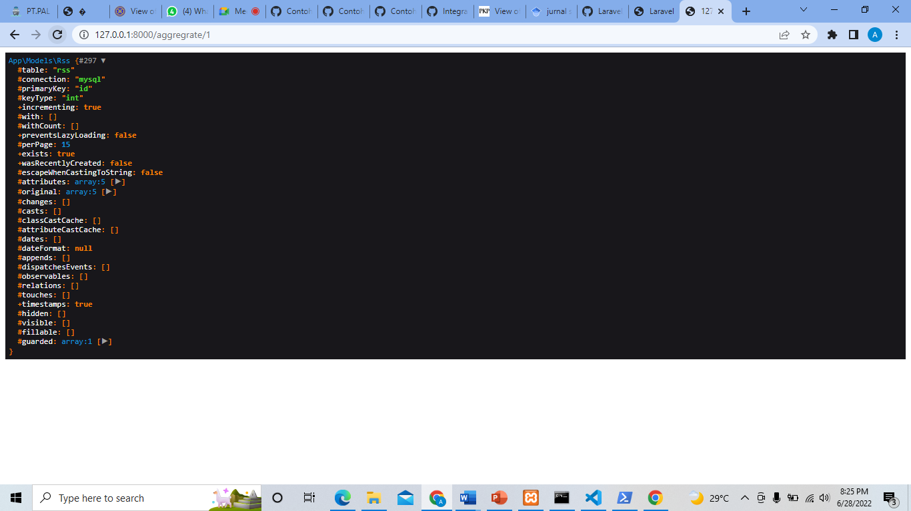
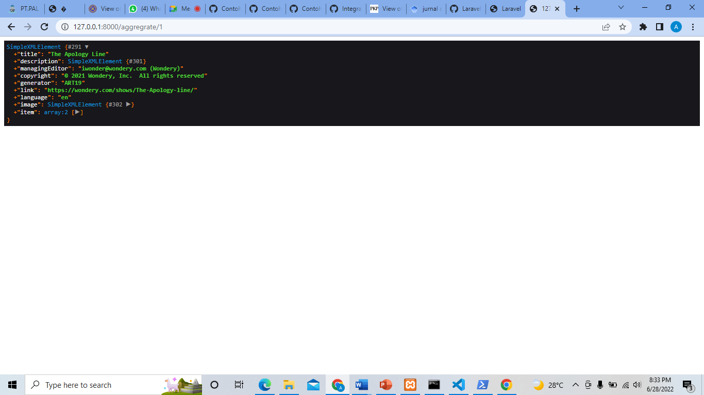
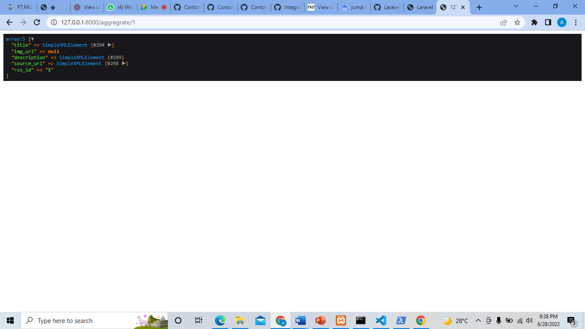
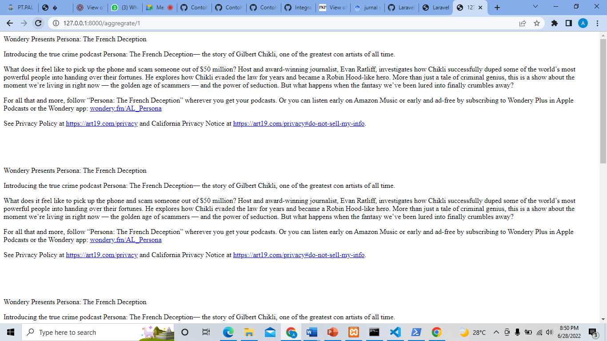

Sebelum melakukan penginstalan laravel, Pastikan sudah menginstall beberapa applikasi : Applikasi xampp dan Composer
Kemudian masuk ke command promp
Selanjutnya masuk ke terminal, buka file xampp/htdocs. Masukkan perintah pada terminal untuk masuk ke htdocs cd C:\xampp\htdocs (sesuaikan file folder xampp anda)
Setelah direktori berganti, gunakan perintah berikut : composer create-project laravel/laravel:^8.0 pemrogramanintegratif (sesuaikan nama project anda)
Jika sudah selesai menginstall, kemudian cek apakah file project yang barusan dibuat apakah sudah ada 
Jika folder sudah ada, selanjutnya terminal menggunakan perintah cd (nama project anda awal membuat tadi)
Jika muncul tulisan Starting Laravel development server pada Terminal, selanjutnya membuka link yang telah disediakan oleh Laravel. alamat server, 127.0.0.1:8000 kemudian buka browser
Maka penginstallan laravel sudah siap digunakan
-----
### Tahap 2
•	Ubah DB_DATABASE di .env sesuai dengan nama database yang dibuat di phpmyadmin
• Buat 2 table rss dan news dengan fitur migrations menggunakan perintah
  ```
  php artisan make:migration create_rss_table
  
  php artisan make:migration create_news_table
  ```
• Tambahkan kolom name dan url pada tabel rss, seperti pada gambar dibawah

• Tambahkan kolom title, img_url, description, source_url,  dan rss_id pada tabel news, seperti pada gambar dibawah
  

• Untuk menjalankan migrasi yang dibuat jalankan perintah diterminal seperti dibawah, lalu cek database
  ```
  php artisan migrate
  ```
  

• Buat koneksi  model  ke database  dengan membuat seeder dan controller untuk tabel Rss dan News, dengan perintah
  ```
  php artisan make:model Rss –seed –controller
  ``
  
  ```
  php artisan make:model Rss –seed –controller
  ``
  
• Edit file Rss.php, RssSeeder.php serta DatabaseSeeder.php seperti pada gambar dibawah
 
• Kemudian cek koneksi dengan perintah
  ```
  php artisan db:seed
  ```

  
• Edit file News.php, NewsController.php, web.php, serta file migration News seperti pada gambar dibawah
  
  
  
  
  

• Cek localhost di http://127.0.0.1:8000/aggregrate/1 dan di database phpmyadmin
  
  
